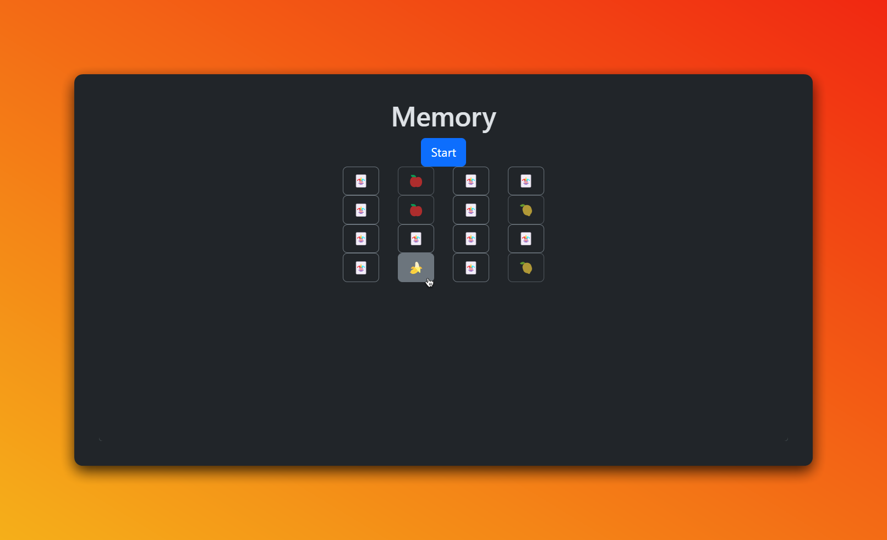

# 🧠 Memory Game



[](https://github.com/EXELVI/Memory_game)
[](https://github.com/EXELVI/Memory_game)
[](https://github.com/EXELVI/Memory_game)

Memory Game is a simple and fun browser game where players match pairs of cards. The game challenges your memory skills with various themes, customizable board sizes, and a sleek Bootstrap-powered interface.

## 🚀 Features

- **Multiple Themes**: Choose from different themes like Fruits, Animals, Flags, Sports, and more.
- **Customizable Board Size**: Set the grid size from 2x2 up to 10x10.
- **Responsive Design**: The game adapts to any screen size, making it perfect for both desktop and mobile devices.
- **Simple and Intuitive UI**: Built with Bootstrap, the game is visually appealing and easy to navigate.
- **Performance Tracking**: The game tracks the number of moves and time taken to complete the board.

## 🎮 How to Play

1. **Select a Theme**: Choose your preferred card theme from the dropdown menu.
2. **Set the Board Size**: Adjust the grid size using the input field. Make sure it's an even number.
3. **Start the Game**: Click the "Start" button to shuffle and display the cards face-down.
4. **Match the Pairs**: Click on two cards to reveal them. If they match, they will stay face-up. If not, they will be turned face-down again.
5. **Win the Game**: Match all pairs with the fewest moves and in the shortest time possible!

## 🛠️ Installation

1. Clone this repository:
    ```bash
    git clone https://github.com/EXELVI/Memory_game.git
    ```

2. Navigate to the project directory:
    ```bash
    cd Memory_game
    ```

3. Open `index.html` in your browser to start the game.


## 🌟 Contributing

Contributions are welcome! If you have any ideas or improvements, feel free to open an issue or submit a pull request.